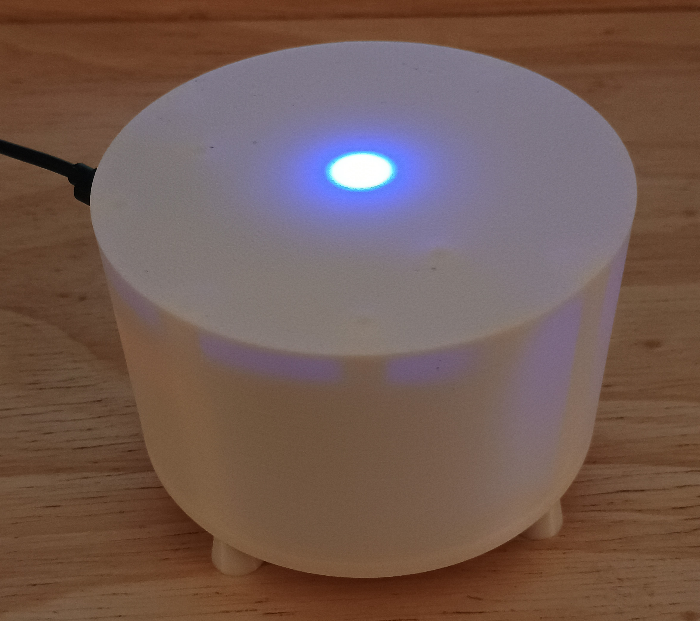
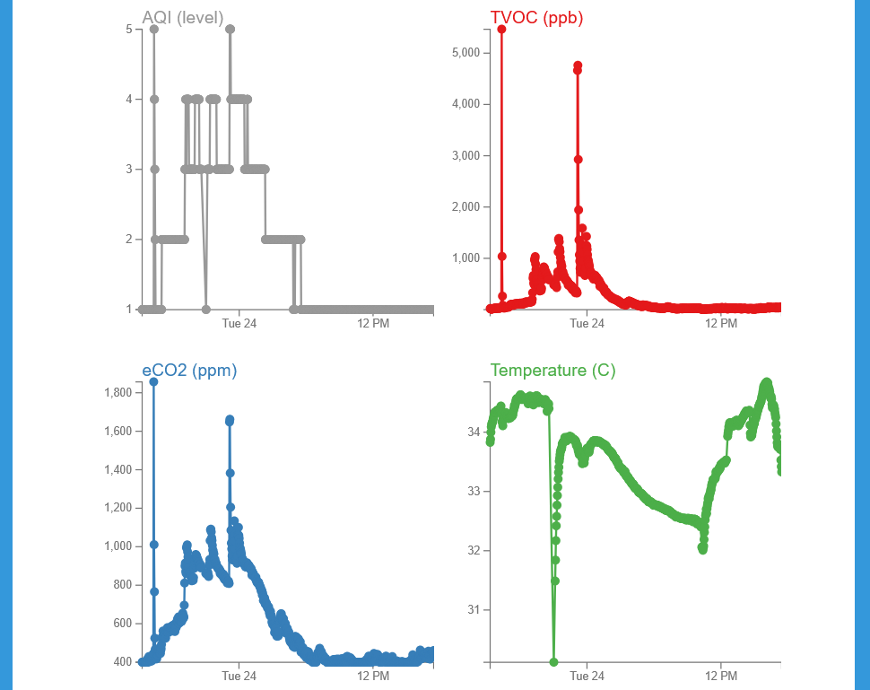

# Cylindair Air Quality Monitor
Cylindair is a modular device that can show and record the estimated overall [air quality index (AQI)](https://en.wikipedia.org/wiki/Air_quality_index) by combining readings from various sensors.


## Contents:
* [What is Cylindair](#what-is-cylindair)
	* [Features](#features)
	* [Parameter Selection](#parameter-selection)
		* [PM2.5](#pm25)
		* [TVOC/eCO2](#tvoceco2)
		* [Other Gases](#other-gases)
* [Limitations](#limitations)
* [Hardware](#hardware)
* [Assembly](#assembly)
* [Setup](#setup)
* [Usage](#usage)
	* [Power-On](#power-on)
	* [LED Indicator](#led-indicator)
	* [Web Interface](#web-interface)
* [Suggested Mods](#suggested-mods)
	* [No WiFi](#no-wifi)
	* [Local Data and Graphs](#local-data-and-graphs)
	* [No Extra LED](#no-extra-led)

## What is Cylindair?
Monitoring the air quality in an environment is very important to the overall health of those living there. Being more aware of the air quality you're living in can help you make informed decisions about your home and implement solutions, such as installing air filters or improving ventilation, before they cause health problems. Having granular, local data in homes and communities, either individually or part of a citizen science campaign, can also help identify areas that are experiencing poor air quality that have been neglected due to historical or social biases, or a lack of resources. As stated in this [NASA article](https://terra.nasa.gov/citizen-science/air-quality):

> Air pollution levels for your region are recorded at state monitoring stations, but air pollution does not necessarily spread itself evenly throughout the region. You may live next to a busy highway or some other source of pollution, or the topography of the land or city may concentrate pockets of polluted air near you. To know exactly what is in the air you are breathing, you need to monitor the air where you are.

### Features
Cylindair is a device intended to make air quality monitoring easy, accessible, and affordable for everyone, and provide the flexibility to adapt to individual needs and budgets. It can also be potentially linked up to data-sharing services to create a crowd-sourced dataset. Some key features include:

* Connectivity: Can connect to WiFi network for retrieving detailed data, or sharing data with others. Can also broadcast its own WiFi network in areas without internet access.
* Flexible: Can be used as a basic air quality monitor for instant feedback, or setup to record and share detailed air quality data. 
* Inexpensive: The Cylindair can be assembled for in the most basic form for ~$50.
* Modular: Can be equipped with any combination of three default sensors, or customized with all the devices, sensors, and features available in the [Fabrica-IO project](https://github.com/FabricaIO).

### Parameter Selection
Deciding which air quality parameters to prioritize is difficult as the most relevant air contaminants for health can vary based on the location and the individual. These parameters were chosen for their broad applicability, sensor module cost and availability, and ease of use.  Fortunately, the Cylindair is designed to be modular and customizable, so if there are other sensor module that aren't available on the [Fabrica-IO](https://github.com/orgs/FabricaIO/repositories?q=sensor) platform, please reach out and we can try and add them, or you can [add them yourself](https://github.com/FabricaIO/FabricaIO-esp32hub/wiki/Adding-a-New-Device).

#### PM2.5
PM2.5 refers to particulates in the air that are 2.5μm in diameter or less. Particle pollution is one of the [most common](https://terra.nasa.gov/citizen-science/air-quality) pollutants and [one of the most hazardous](https://pmc.ncbi.nlm.nih.gov/articles/PMC9223652/). Fortunately, PM2.5 modules are common, inexpensive, and reliable. PM2.5 measurements should be included in pretty much all air quality monitors.

#### TVOC/eCO2
TVOC refers to the total [volatile organic compounds](https://en.wikipedia.org/wiki/Volatile_organic_compound) in the air, and can be used to calculate an estimated carbon dioxide concentration, but that value is very rough. Common sources of VOCs in the home can include cleaning products, solvents, upholstery, and cooking. The hazards of VOCs vary greatly depending on which compounds are in the air, and TVOC measurements look only at the total amount of VOCs present, not which ones are there. Thus, it's impossible to draw firm safety conclusions from TVOC measurements. Still, TVOC measurements can help provide estimates of the air quality and highlight if there is a spike in VOCs in the air which can be concerning. This can be especially useful as the above PM2.5 measurements can miss non-particulate containments that TVOC devices can measure, so PM2.5 and TVOC can be combined to calculate an overall AQI.

#### Other Gases
A MEMS gas sensor can help measure the concentrations of various gasses in the air, depending on the module. While theses devices have [some](#calibration) [limitations](#specificity), they can help give clues to narrow down which gas pollutants are present where the TVOC measurement above can't give any specifics. The primary advantage of MEMS gas modules are their relative affordability and longevity compared to factory calibrated electrochemical gas sensors. This measurement is not used in AQI calculations since it doesn't really provide significantly different or better data than the TVOC measurement above. This measurement is best for those with a real interest in gathering and analyzing as much data as possible.

## Limitations
While the Cylindair is an excellent module that can help us become more informed about our environment, there are some limitations and caveats to be aware of. Nearly all these limitations could be mitigated by using more expensive sensor modules or more sophisticated data analysis tools, but that would make the Cylindair less accessible. Thus, this base version device consists of recommendations that try to balance these limitations with accessability, though a more sophisticated version could easily be built.

None of these limitations invalidate the usefulness of this device, but the data and information it collects should be understood in the proper context to help you decide if it can fit your needs. Starting with a Cylindair to see if there are any obvious problems is an easy and inexpensive way to see if more sophisticated testing is called for.

So given all that, here are some important things to keep in mind:

### Outdoor Use
This device is designed primarily for indoor use due the the case not being weatherproof. However, if printed in a suitable material (PETG, ABS, etc.), and placed in a fairly sheltered spot, careful outdoor use should be possible.

### Calibration
The sensor modules recommended for this device are not factory calibrated. These were cost saving choices. This means the readings can't be taken as exact values. It's better to think of these measurements as good estimations for informing people about their environment and tracking changes to the air quality.

### Baseline
If using the TVOC or MEMS gas sensor, they expect to be in a clean environment for the first few minutes after the device is powered on to establish a baseline. Measurements are generally presented relative to this baseline, so if the air quality is poor during this calibration phase, it could be mistakenly reported as clean air. Turning the device off and back on again when the air is clean will reset this baseline. The PM2.5 sensor is not affected by this and has no such limitation.

### Specificity
The MEMS gas sensor used does not have high specificity, so a gas that it does not measure could trigger a false positive for one or more gasses it does measure, especially in high concentrations. For example, the device could report ethanol being present when in fact the air has isopropanol, not ethanol. These measurements are best used as a guide or warning to further investigate possible areas of concern.

## Hardware
This is the hardware used in the Cylindair device. This hardware will work with the example configuration below and fits in the 3D printed case. However, you can use any Fabrica-IO compatible sensors, and can modify the [case](#assembly) as need.

Links to example places to purchase the items are provided, but any similar item should work. You'll need to supply your own USB-C cable and power adapter, but any USB power adapter should be sufficient.

1. [Firebeetle ESP32-E](https://www.dfrobot.com/product-2231.html), required.
2. [Firebeetle Shield](https://www.dfrobot.com/product-2395.html), optional but makes assembly much easier.
3. [PM2.5 Sensor](https://www.dfrobot.com/product-2439.html), optional, but this or the TVOC are required.
4. [TVOC Sensor](https://www.dfrobot.com/product-2064.html), optional, but this or the PM2.5 are required. This unit combines TVOC and temperature/humidity sensors for better measurements, but can be purchased separately as the [ENS160](https://www.dfrobot.com/product-2526.html) and optionally the [BME680](https://www.dfrobot.com/product-1697.html).
5. [MEMS Gas Sensor](https://www.dfrobot.com/product-2417.html), optional. This isn't used in AQI calculations, but can provide additional information for those who want more details.
6. [RGB LED](https://www.amazon.com/ALITOVE-100pcs-WS2812B-Addressable-Arduino/dp/B01D1FFVOA), optional, but very useful for showing the current AQI in real time. Can use any NeoPixel compatible LED, with WS2812 being the most common.
7. [M2 Heat Set Inserts](https://www.amazon.com/Moicstiy-Threaded-Inserts-M2x4x3-2-Printing/dp/B0DQL44Z2V), required if using the 3D printed case.
8. [M3 Heat Set Inserts](https://www.amazon.com/Moicstiy-Threaded-Inserts-M2x4x3-2-Printing/dp/B0DQL5YWKQ), required if using the 3D printed case.
9. [M2x4 Screws](https://www.amazon.com/MroMax-Machine-Cabinet-Stainless-Phillips/dp/B07YC7LC5H), required if using the 3D printed case. Any length between 3-5mm should work.
10. [M3x8 Screws](https://www.amazon.com/MroMax-Machine-Cabinet-Stainless-Phillips/dp/B07YCC2X7Z), required if using the 3D printed case. A 6mm length screw should also work.
11. [Jumper Wires F/F](https://www.amazon.com/California-JOS-Breadboard-Optional-Multicolored/dp/B0BRTKTV64), required to hook up the TVOC sensor, and can be soldered to the RGB LED for an easier hookup.

## Assembly
This guide will cover assembly of device with all the optional accessories, skip any parts for devices or addons not being used.

The first step is to print the case, if using. From the [case](case/) folder, print one base, one lid, and four feet. It's recommended to use TPU or similar to print the feet and a white material for the lid so the LED colors show well. Once printed, use a soldering iron to embed the appropriate heat set inserts into the posts on the lid and base.

The original model of the case can be found on OnShape [here](https://cad.onshape.com/documents/e1bc6eef3c296f13328b4ea3/w/8819127dd3330596ef8d2a02/e/4943a45a48580da0d1e130dd?renderMode=0&uiState=699e70728d53160defecc00d), and can be modified as needed for other sensor modules or configurations.

Once the case is done, use the M2 screws to attach the Firebeetle, without its shield, to the underside of the case lid (see the image below).

Next, if using the TVOC sensor or RGB LED, solder on the pins for the TVOC. For the RGB LED, cut three of the jumper wires in half, strip them and solder them to the `5V`, `gnd`, and `Din` pads on the LED, leaving the female connectors on the other end.

Using the jumpers or connectors included with the sensor module, connect all the sensor modules to the I2C pins on the Firebeetle shield using the below hookup guide (the PM2.5 and MEMS gas module linked in this guide also have color-coded wires to match the Firebeetle shield):

```
VCC or 3V3 ---> +
GND ----------> -
SCL ----------> C
SDA ----------> D
```
Next, connect the RGB LED to the Firebeetle shield using the below hookup guide:

```
5V  ---> +
gnd ---> -
Din ---> Digital pin 6
```

Next, screw each sensor module into the case base with the sensors themselves facing down and exposed to the grid of holes in the base. Then plug the Firebeetle shield into the Firebeetle. Lastly, press the RGB LED into the center post on the underside of the lid. It should hold just by press fitting, but glue can also be used. When everything is in place, it should look like the below photo:


Fit the base into the lid, there is a notch to help with alignment. Put M3 screws through the feet, and use that to screw the feet to the base, which also screws the base into the lid. Finally, connect to USB power using the hole in the lid, and you're done!

## Setup

This will cover the software setup and configuration of the Cylindair. This mostly follows the standard Fabrica-IO setup.

First, download and install the [Fabrica-IO app](https://github.com/FabricaIO/FabricaIO-App/wiki/App-Usage). Set up a new project directory. Next, download the [Cyindair project](fabrica-io/Cylindair-Project.json) from this repository. Load it in the app, then connect the Firebeetle to the computer via USB. [Build](https://github.com/FabricaIO/FabricaIO-App/wiki/App-Usage#usage) the program, then [flash](https://github.com/FabricaIO/FabricaIO-App/wiki/App-Usage#flash-firmware-menu) the firmware following those linked guides.

Next, follow the instructions to [connect to WiFi](https://github.com/FabricaIO/FabricaIO-esp32hub/wiki/WiFi-and-Web-Interface#connecting-to-wifi) and then upload the [default web interface](https://github.com/FabricaIO/FabricaIO-esp32hub/wiki/WiFi-and-Web-Interface#connecting-to-the-web-interface). Once that's done, download the [Cylindair configuration](fabrica-io/Cyindair-Config.json) from this repository, and then from the "Storage Manager" on the device's web interface, restore it as a backup. Reboot the device from the home menu. After that, your setup should be complete. See the next section for important notes on the usage and first time setup of the Cylindair.

## Usage

### Power On
If you are using the TVOC or MEMS gas sensor modules, they require a warmup/calibration period after powering-on before they can be used. You'll see a red light inside the Cylindair during this warmup/calibration period. In normal operation, it takes ~3 minutes for the sensors to be ready, and once that's done you'll start seeing the LED indicator light up according to the [table below](#led-indicator) as measurements are taken.

However, the very first time you use the device, the TVOC requires an hour to burn-in before you'll start seeing measurements or the LED light up. After that, it must be left on for at least 24-hours or it will need to repeat that hour burn-in period. After that, it should operate normally with the 3 minute warmup.

### LED Indicator
During normal operation the LED indicator will light up with a color according to how clean the air is, and will update every two seconds. Those colors are:

| Color   |                                                                      |  Air Quality                   |
| ------- | -------------------------------------------------------------------- | -------------------------------|
| Blue    | $${\color{Cerulean}\Huge&#9632;}$$  | Excellent                      |
| Green   | $${\color{Green}\Huge&#9632;}$$     | Good                           |
| Yellow  | $${\color{Goldenrod}\Huge&#9632;}$$ | Unhealthy for sensitive groups |
| Orange  | $${\color{Orange}\Huge&#9632;}$$    | Unhealthy                      |
| Red     | $${\color{Red}\Huge&#9632;}$$       | Very unhealthy                 |
| Magenta | $${\color{Magenta}\Huge&#9632;}$$   | Hazardous                      |

### Web Interface
After setting up your Cylindair, it's generally not necessary to access the web interface unless you want to change settings or access more detailed data. The web interface should be accessible at the address `http://airsensor.local`, but if not, you can connect the Cylindair to your computer again and use the [serial monitor](https://github.com/FabricaIO/FabricaIO-App/wiki/App-Usage#flash-firmware-menu) in the Fabrica-IO app to see the IP address.

> [!IMPORTANT]
> If you are not using the TVOC module you'll need to go into the web interface and change the "Cylindair Monitor" settings in the "Device Manager", setting the "TVOC_AQI" option to "None".

## Suggested Mods
While the Cyindair will work as a useful and informative tool as is, it can be expanded with other functionality or modified to work in different ways. While there are numerous ways to add sensors ro other functionality to the device, this is a collection a few common and useful tweaks or mods.

### No WiFi
If you don't want to have your Cylindair connected to WIFi after settings it up, go into the [web interface](#web-interface) and under the "Hub Configuration" menu, uncheck the [WiFiClient](https://github.com/FabricaIO/FabricaIO-esp32hub/wiki/Hub-Configuration#wificlient) option, save, and then reboot the device from the home menu. Now the device will work by broadcasting it's own WiFi network and won't need connect to another one.

### Local Data and Graphs
You can record air quality data to the device by adding the [LocalDataLogger](https://github.com/FabricaIO/actor-LocalDataLogger) to the project. After data is collected, you can download it from the "Storage Manager" section in the [web interface](#web-interface) for processing. For example, charts like this can be produced:


You can also add the [Data-Visualizer](https://github.com/FabricaIO/Data-Visualizer) module to render basic graphs in the device web interface automatically.



In the default configuration, if a data point is recorded every minute, the device can hold approximately a week's worth of data at a time.

### No Extra LED
While the Cylindair uses an external RGB LED to clearly indicate the air quality, the Firebeetle has one built-in that can be used instead. The limitation is that it will not be as visible when using the case.

To enable using the built-in LED to indicate the air quality, log into the [web interface](#web-interface) and under the "Device Manager" section select the "Indicator" device. Change the "Pin" option from "14" to "5" and update the configuration. Now the built-in LED should show the overall air quality as described [above](#led-indicator).
